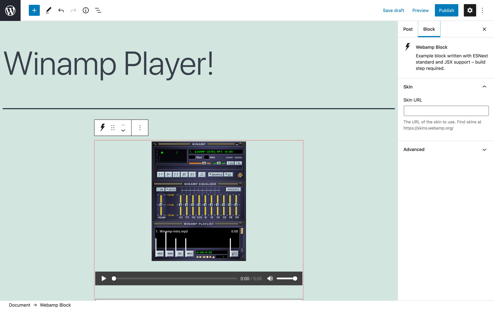
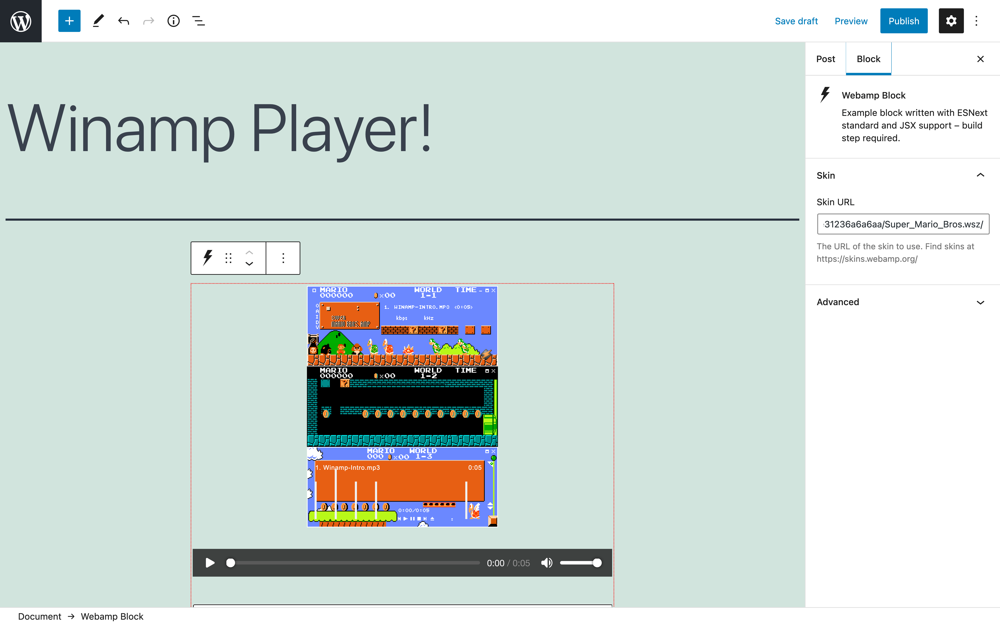

# Webamp Block for WordPress

> A Winamp-styled audio block for all your retro music player needs.

   

## Overview

Do you miss the days of filling up your computer's harddrive with MP3 files, burning CDs with your favorite party mixes, the glam and grunge fashion styles, waiting every week for the latest episodes of Friends and Sex and the City (sorry, no binging on streaming episodes), and all that came with the 90s?  Do you wish the WordPress core blocks offered you more styles to match your interests?  Then look no further, because this plugin transforms a bland audio block into a llama-riffic Winamp-stlyed audio block!

**Disclaimer:** _[Winamp](https://en.wikipedia.org/wiki/Winamp) and the Winamp logo are property of [Nullsoft Inc.](https://en.wikipedia.org/wiki/Nullsoft) and its owner [Radionomy Group](https://en.wikipedia.org/wiki/Radionomy) (now defunct).  This project also leverages the [MIT-licensed](https://github.com/captbaritone/webamp/blob/master/LICENSE.txt) [Webamp player](https://webamp.org/), many thanks to  Jordan Eldredge for his efforts there._

## Requirements

* PHP 7.2+
* [WordPress](http://wordpress.org/) 5.2+

## Installation

1. Install the plugin via the plugin installer, either by searching for it or uploading a ZIP file.
1. Activate the plugin.
1. Use a Winamp-styled audio player block on your site; what retro fun!

## Changing Player Skins

In order to select alternate player skins, browse [the Winamp Skin Museum](https://skins.webamp.org/) and find a preferred skin, copy the URL of the specific skin (e.g., https://skins.webamp.org/skin/bb0bf8064d108271afea419308dcb6ea/NES_Duck_Hunt.wsz/), and paste that URL in the `Skin URL` field in the Webamp Block Skin settings.

## Frequently Asked Questions

### This is amazing, how can I help contribute to this plugin?

Great question and I could not agree with you more!  You can help contribute to this [Webamp Block plugin on GitHub](https://github.com/10up/webamp-block) or to the [Webamp project on GitHub](https://github.com/captbaritone/webamp).

### Ok this is making me nostalgic, how can I submit a new skin for the player?

Details on how to create a new skin is available [here](https://github.com/WACUP/Winamp-Skinning-Archive/blob/master/Classic%20Skins/Winamp_skinning_tutorial_1_5_0.pdf).  I would recommend downloading the [base Winamp skin](https://skins.webamp.org/skin/5e4f10275dcb1fb211d4a8b4f1bda236/base-2.91.wsz/), renaming the file extension from .WSZ to .ZIP, unzipping that file and inspecting all the bitmap and textfiles.  Then use your favorite design program to craft a skin design, cut it up into the component bitmap parts, add your info to the relevant textfiles, then ZIP all that up and rename the extension to WSZ.  Finally, [upload your custom skin](https://skins.webamp.org/upload/) to the Winamp Skin Museum and once its accepted you'll be able to reference it within the Webamp Block's Skin settings.  Good luck!

## Support Level

**Active:** 10up is actively working on this, and we expect to continue work for the foreseeable future including keeping tested up to the most recent version of WordPress.  Bug reports, feature requests, questions, and pull requests are welcome.

## Changelog

A complete listing of all notable changes to Webamp Block are documented in [CHANGELOG.md](https://github.com/10up/webamp-block/blob/develop/CHANGELOG.md).

## Contributing

Please read [CODE_OF_CONDUCT.md](https://github.com/10up/webamp-block/blob/develop/CODE_OF_CONDUCT.md) for details on our code of conduct, [CONTRIBUTING.md](https://github.com/10up/webamp-block/blob/develop/CONTRIBUTING.md) for details on the process for submitting pull requests to us, and [CREDITS.md](https://github.com/10up/webamp-block/blob/develop/CREDITS.md) for a listing of maintainers of, contributors to, and libraries used by Apple Maps for WordPress.

## Like what you see?

